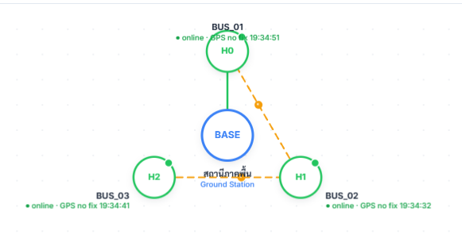
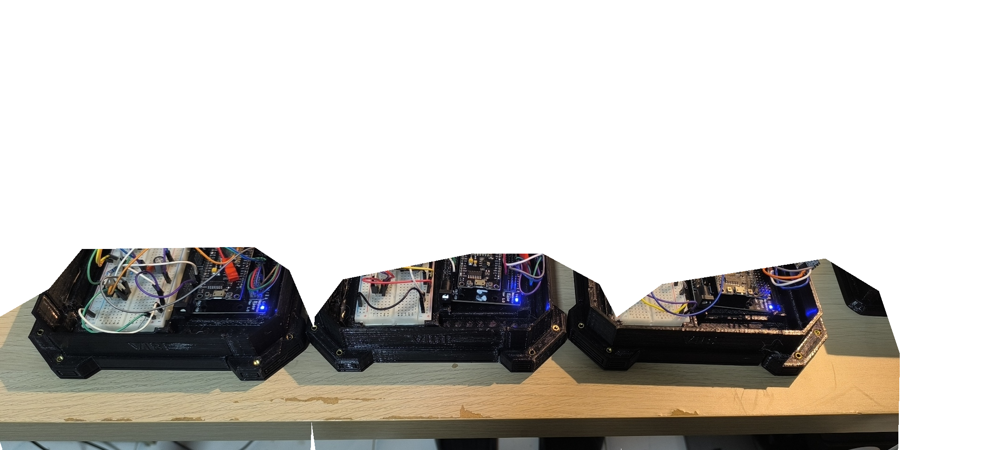
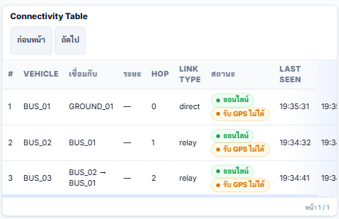
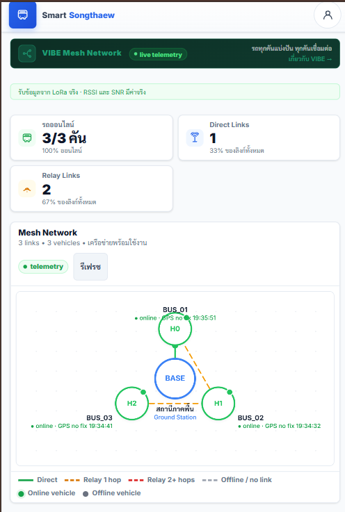
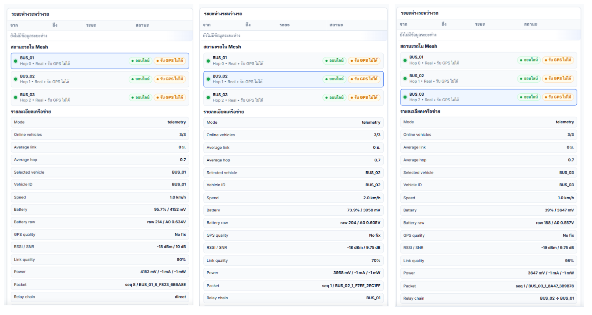

# 🚎 SMART SONGTHAEW PLATFORM
### แพลตฟอร์มสมาร์ทสองแถว: สถาปัตยกรรมคลาวด์และไอโอทีติดตามยานพาหนะแบบเรียลไทม์ เพื่อยกระดับคุณภาพชีวิตและลดความเหลื่อมล้ำทางดิจิทัลด้านการเดินทางของประชาชนในส่วนภูมิภาค

[](https://smart-songthaew.onrender.com)
[]()
[]()
[]()
[]()
[]()

> **การแข่งขันพัฒนาโปรแกรมคอมพิวเตอร์แห่งประเทศไทย ครั้งที่ 28 (The 28th National Software Contest: NSC 2026)**  
> **หมวดการแข่งขัน:** โปรแกรมเพื่อการประยุกต์ใช้งานบนเครือข่าย หรือโปรแกรมเพื่อพัฒนาคุณภาพชีวิตและสังคม (หมวด 23)  
> **รหัสโครงการ:** `28P23S00194`  
> **ผู้พัฒนา:** นายกันตภณ วงศ์พรต (นักเรียนชั้นมัธยมศึกษาปีที่ 6)  
> **อาจารย์ที่ปรึกษา:** นายอัศวิน จุลมูล  
> **สถานศึกษา:** โรงเรียนเตรียมอุดมศึกษาภาคใต้ จังหวัดนครศรีธรรมราช  
> **ระบบทดสอบจริง (Live Production):** [https://smart-songthaew.onrender.com](https://smart-songthaew.onrender.com)

---

## 📌 สารบัญ (Table of Contents)

1. [ความเป็นมา ที่มาของปัญหา และแรงบันดาลใจ (Background & Motivation)](#1-ความเป็นมา-ที่มาของปัญหา-และแรงบันดาลใจ-background--motivation)
2. [ปัญหาที่แท้จริงของ 2 ฝ่าย (Two-Sided Pain Points)](#2-ปัญหาที่แท้จริงของ-2-ฝ่าย-two-sided-pain-points)
3. [นวัตกรรมและแนวคิดหลักของโครงการ (Core Innovations & Concepts)](#3-นวัตกรรมและแนวคิดหลักของโครงการ-core-innovations--concepts)
4. [สถาปัตยกรรมระบบโดยรวม (System Architecture)](#4-สถาปัตยกรรมระบบโดยรวม-system-architecture)
5. [การออกแบบฮาร์ดแวร์ VIBE และกล่อง 3D PETG (Hardware & Mechanical Design)](#5-การออกแบบฮาร์ดแวร์-vibe-และกล่อง-3d-petg-hardware--mechanical-design)
6. [ผลการทดสอบระบบและประสิทธิภาพภาคสนาม (Field Test & Validation Results)](#6-ผลการทดสอบระบบและประสิทธิภาพภาคสนาม-field-test--validation-results)
7. [ผลกระทบเชิงเศรษฐกิจ สังคม และความยั่งยืน (Social & Economic Impact)](#7-ผลกระทบเชิงเศรษฐกิจ-สังคม-และความยั่งยืน-social--economic-impact)
8. [คุณสมบัติของซอฟต์แวร์และส่วนติดต่อผู้ใช้ (Software Features)](#8-คุณสมบัติของซอฟต์แวร์และส่วนติดต่อผู้ใช้-software-features)
9. [คู่มือการติดตั้งและทดสอบสำหรับนักพัฒนา (Developer & Deployment Guide)](#9-คู่มือการติดตั้งและทดสอบสำหรับนักพัฒนา-developer--deployment-guide)
10. [ปัญหา อุปสรรค และแนวทางการพัฒนาต่อยอด (Challenges & Future Work)](#10-ปัญหา-อุปสรรค-และแนวทางการพัฒนาต่อยอด-challenges--future-work)
11. [ข้อมูลคณะผู้จัดทำและช่องทางติดต่อ (Credits & Contact Information)](#11-ข้อมูลคณะผู้จัดทำและช่องทางติดต่อ-credits--contact-information)

---

## 1. ความเป็นมา ที่มาของปัญหา และแรงบันดาลใจ (Background & Motivation)

### บริบทความเหลื่อมล้ำของระบบขนส่งสาธารณะไทย
ในเขตกรุงเทพมหานครและเมืองศูนย์กลางเศรษฐกิจขนาดใหญ่ เทคโนโลยีติดตามยานพาหนะสาธารณะแบบดิจิทัล (เช่น รถไฟฟ้า BTS/MRT, รถเมล์ ขสมก. ผ่าน ViaBus) ได้ช่วยให้ประชาชนสามารถตรวจสอบเส้นทาง ตำแหน่งรถแบบเรียลไทม์ และวางแผนการเดินทางในชีวิตประจำวันได้อย่างสะดวกรวดเร็ว

ทว่าใน **พื้นที่ต่างจังหวัดและส่วนภูมิภาค** รถสาธารณะหลักที่หล่อเลี้ยงวิถีชีวิตของผู้คนไม่ใช่รถไฟฟ้าหรือรถเมล์ขนาดใหญ่ แต่คือ **"รถสองแถว"** ซึ่งเป็นระบบขนส่งมวลชนท้องถิ่นที่เชื่อมโยงระหว่างบ้าน โรงเรียน ตลาด สถานที่ทำงาน โรงพยาบาล และศูนย์กลางชุมชนเข้าด้วยกัน อย่างไรก็ดี รถสองแถวในปัจจุบันยังคงเป็นระบบขนส่งแบบดั้งเดิม (Analog) ที่ **"ผู้โดยสารมองไม่เห็น"** ไม่มีระบบดิจิทัลบอกตำแหน่ง ไม่ทราบตารางเวลาที่แน่นอน และไม่มีช่องทางตรวจสอบว่ารถคันถัดไปจะมาถึงเมื่อใด

### ความสอดคล้องกับนโยบายระดับประเทศและสากล
- **ข้อเสนอเชิงนโยบาย TDRI:** สถาบันวิจัยเพื่อการพัฒนาประเทศไทย (TDRI) ระบุว่า แกนหลักของปัญหาการขนส่งสาธารณะไทยผูกอยู่กับ 3 มิติคือ **"เวลา ความแน่นอน และการเข้าถึงพื้นที่ปลายทาง"** พร้อมเสนอว่ารถโดยสารสาธารณะที่ได้รับการยกระดับควรติดตั้งระบบ GPS และเชื่อมต่อแอปพลิเคชันให้ผู้โดยสารตรวจสอบตำแหน่งได้จริง
- **เป้าหมายการพัฒนาที่ยั่งยืน (UN SDG 11.2):** โครงการนี้มุ่งสนับสนุนเป้าหมาย SDG 11 (Sustainable Cities and Communities) ข้อ 11.2 ว่าด้วยการจัดให้ทุกคนสามารถเข้าถึงระบบคมนาคมขนส่งที่ปลอดภัย ราคาย่อมเยา เข้าถึงได้สะดวก และยั่งยืน เพื่อลดความเหลื่อมล้ำทางดิจิทัล (Digital Divide) ด้านการเดินทางของประชาชนในส่วนภูมิภาค

---

## 2. ปัญหาที่แท้จริงของ 2 ฝ่าย (Two-Sided Pain Points)

จากการลงพื้นที่สำรวจและวิเคราะห์บริบทจริงในจังหวัดนครศรีธรรมราช พบว่าอุปสรรคสำคัญที่ทำให้ระบบติดตามรถไม่เคยเกิดขึ้นสำเร็จในรถสองแถวท้องถิ่น เกิดจากความไม่สอดคล้องของปัญหาและความต้องการระหว่างสองฝ่าย:

```
┌───────────────────────────────────────────────┐     ┌───────────────────────────────────────────────┐
│              ฝั่งผู้โดยสาร (Passenger)           │     │       ฝั่งผู้ประกอบการสองแถว (Operator)       │
├───────────────────────────────────────────────┤     ├───────────────────────────────────────────────┤
│ ❌ ไม่ทราบตำแหน่งรถและเวลาที่รถจะมาถึง (ETA)   │     │ ❌ อุปกรณ์ GPS เชิงพาณิชย์ราคาแพงมาก          │
│ ❌ เวลารอรถไม่แน่นอน เสียเวลา/เสียโอกาสชีวิต   │     │    (3,000 – 5,000 บาท / กล่อง)               │
│ ❌ ข้อมูลการเดินรถไม่ชัดเจน                    │     │ ❌ ภาระค่าซิม 4G รายเดือนสูงเกินไป            │
│ ❌ เสี่ยงอันตรายในการยืนรอริมถนนเปลี่ยว         │     │    (300 – 500 บาท / คัน / เดือน)             │
│    (โดยเฉพาะนักเรียน ผู้หญิง และผู้สูงอายุ)   │     │ ❌ ติดตั้งยุ่งยาก ต้องตัดต่อดัดแปลงระบบไฟรถ   │
└───────────────────────────────────────────────┘     └───────────────────────────────────────────────┘
                                        ▼                                     ▼
                        ┌─────────────────────────────────────────────────────────────┐
                        │                 SMART SONGTHAEW PLATFORM                    │
                        │   ติดตามรถสองแถวเรียลไทม์ ผ่าน LoRa Mesh + Web App ไม่โหลดแอป  │
                        │        ต้นทุนฮาร์ดแวร์ต่ำ • ไม่ต้องจ่ายค่าซิมเน็ตทุกคัน • เสียบใช้ได้ทันที    │
                        └─────────────────────────────────────────────────────────────┘
```

1. **ฝั่งผู้โดยสาร (Passengers & Students):**
   - **ความไม่แน่นอนของเวลา:** ต้องยืนรอรถโดยไม่รู้ว่าจะมาเมื่อไหร่ ทำให้เสียเวลาเรียน เสียงาน หรือพลาดนัดหมายสำคัญ
   - **ความปลอดภัยในชีวิต:** ในพื้นที่ชนบท ป้ายรอรถมักเป็นศาลาริมทางหรือริมถนนสายรองที่ไม่มีไฟส่องสว่างเพียงพอ การยืนรอรถเป็นเวลานานในยามค่ำคืนหรือช่วงฝนตกก่อให้เกิดความเสี่ยงต่อความปลอดภัย
   - **อุปสรรคในการเข้าถึงแอป:** ผู้สูงอายุและผู้ใช้ทั่วไปมักมีโทรศัพท์มือถือที่มีหน่วยความจำจำกัด การบังคับให้โหลดแอปพลิเคชันเฉพาะทางทำให้คนส่วนใหญ่เลือกที่จะไม่ใช้งาน

2. **ฝั่งผู้ประกอบการและคนขับรถสองแถว (Operators & Drivers):**
   - **ต้นทุนอุปกรณ์สูง:** กล่อง GPS Tracker เชิงพาณิชย์ในท้องตลาดมีราคา 3,000 – 5,000 บาท ซึ่งไม่คุ้มค่าทางเศรษฐกิจสำหรับคนขับรถรับจ้างรายย่อย
   - **ภาระค่าบริการรายเดือน (Recurring Cellular Cost):** การที่ต้องใส่ซิม 4G/LTE ทุกคัน คิดเป็นต้นทุนคันละ 300 – 500 บาท/เดือน (ปีละ 3,600 – 6,000 บาท/คัน) กลายเป็นอุปสรรคใหญ่ที่สุดที่ทำให้ระบบไม่ยั่งยืน
   - **ความยุ่งยากในการติดตั้ง (Retrofit Barrier):** ระบบทั่วไปต้องช่างเทคนิคตัดต่อสายไฟเมนของตัวรถ เสี่ยงต่อการลัดวงจร ไฟไหม้ หรือประกันรถยนต์ขาด

---

## 3. นวัตกรรมและแนวคิดหลักของโครงการ (Core Innovations & Concepts)

แพลตฟอร์ม Smart Songthaew ได้รับการออกแบบขึ้นมาใหม่ทั้งหมดเพื่อแก้ Pain Points ข้างต้นอย่างตรงจุด ผ่าน 5 นวัตกรรมหลัก:

### 3.1 นวัตกรรมระบบสื่อสาร VIBE (Vehicle Information Broadcast Exchange)
ได้รับแรงบันดาลใจจากเทคโนโลยี **ADS-B (Automatic Dependent Surveillance-Broadcast)** ที่ใช้ในอุตสาหกรรมการบินสากล โดยเครื่องบินจะส่งสัญญาณระบุพิกัด ความเร็ว และทิศทางของตนเองออกไปในอากาศแบบสาธารณะ  
โครงการนี้นำหลักการดังกล่าวมาประยุกต์ใช้กับ **รถสองแถวท้องถิ่น** โดยให้รถสองแถวแต่ละคันส่งกระจายแพ็กเก็ตข้อมูลระบุตัวตน (Vehicle ID), พิกัด GPS, ความเร็ว, ทิศทาง และสถานะพลังงาน ผ่านคลื่นวิทยุพลังงานต่ำ Sub-GHz เพื่อให้รถคันอื่นและสถานีฐานในพื้นที่รับรู้ได้ทันที

### 3.2 เครือข่าย LoRa Multi-hop Mesh Networking (หัวใจของระบบ)
- **ไม่จำเป็นต้องมีซิม 4G ในรถทุกคัน:** รถสองแถวใช้โมดูลวิทยุ LoRa ย่านความถี่สาธารณะของประเทศไทย (AS923 / 923 MHz) ในการสื่อสาร
- **Vehicle-to-Vehicle (V2V) & Vehicle-to-Infrastructure (V2I):** รถที่อยู่นอกระยะสัญญาณของสถานีฐาน สามารถส่งข้อมูล "กระโดดข้าม" (Hop Relay สูงสุด 2–3 ทอด) ผ่านรถสองแถวคันข้างหน้าเพื่อส่งต่อไปยังสถานีฐาน (Ground Station)
- **ต้นทุนค่าอินเทอร์เน็ตลดลงเหลือจุดเดียว:** มีเพียงสถานีฐาน (Ground Station) ประจำจุดตรวจหรือจุดจอดหลักเท่านั้นที่เชื่อมต่อ Wi-Fi หรือ Cellular Gateway เพื่อส่งข้อมูลขึ้น Cloud ทำให้ประหยัดค่าซิมการ์ดให้กับฝูงรถทั้งเส้นทาง

```
[ รถคันที่ 3 (BUS_03) ] ──(Hop 2)──► [ รถคันที่ 2 (BUS_02) ] ──(Hop 1)──► [ รถคันที่ 1 (BUS_01) ] ──(Hop 0)──► [ สถานีฐาน (GROUND_01) ] ──(Internet)──► [ CLOUD & WEB ]
  (อยู่นอกระยะสถานี)                     (ทำหน้าที่ Relay)                     (ใกล้สถานีที่สุด)
```

### 3.3 ระบบบัฟเฟอร์ข้อมูลออฟไลน์ Store-and-Forward
ในภูมิประเทศจริงที่มีหุบเขา อาคารสูง หรือป่าทึบบดบังสัญญาณวิทยุ (Dead Zone) อุปกรณ์ VIBE บนตัวรถจะมีระบบ **Offline Ring-Buffer Caching** ทำการบันทึกประวัติพิกัดและลำดับแพ็กเก็ต (Sequence & Hash) ไว้ในหน่วยความจำชั่วคราว และเมื่อรถวิ่งกลับเข้ามาในรัศมีเครือข่าย VIBE ระบบจะทำการ "Flush & Forward" ส่งข้อมูลย้อนหลังกลับเข้าสถานีฐานโดยอัตโนมัติ ป้องกันข้อมูลตำแหน่งสูญหาย

### 3.4 เครื่องคำนวณและคาดการณ์เวลา VIBE Predict (AI & Estimation Engine)
ระบบหลังบ้านประกอบด้วยเครื่องมือประมวลผลตำแหน่งอัจฉริยะ 3 ขั้นตอน:
1. **Map Matching:** จับพิกัดละติจูด/ลองจิจูดจาก GPS ให้เข้าสู่แนวแกนถนนจริง (Snapped to Route Geometry) ลดข้อผิดพลาดจากสัญญาณสะท้อน (Multipath) และ GPS Drift
2. **Kalman Filter:** คาดคะเนตำแหน่งและความเร็วอย่างราบรื่น (Smooth Motion) แม้ในช่วงเวลาที่สัญญาณขาดหายชั่วคราว
3. **Route Profile & Traffic-Aware ETA:** เรียนรู้ความเร็วเฉลี่ยตามสภาพถนนและช่วงเวลา คำนวณเวลาที่รถจะมาถึงป้ายปลายทาง พร้อมระบุระดับความเชื่อมั่น (Confidence Score)

### 3.5 ประสบการณ์ผู้โดยสารแบบไร้รอยต่อ (Zero-Barrier Web Experience)
ผู้โดยสารสามารถเปิดดูตำแหน่งรถสองแถวแบบเรียลไทม์ได้ทันทีผ่าน Web Browser (Chrome, Safari, Edge) ทั้งบนมือถือ แท็บเล็ต และคอมพิวเตอร์ **โดยไม่ต้องดาวน์โหลดหรือติดตั้งแอปพลิเคชันใดๆ** เพียงแค่สแกน QR Code ที่ป้ายรถสองแถวหรือคลิกลิงก์ระบบ

---

## 4. สถาปัตยกรรมระบบโดยรวม (System Architecture)



ระบบแบ่งออกเป็น 4 ชั้นการทำงานหลัก (Layer Architecture):

```mermaid
flowchart TD
    subgraph S1["1. ยานพาหนะ (Vehicle Node - VIBE)"]
        GPS["NEO-6M GPS"] -->|พิกัด/ความเร็ว| MCU["ESP8266 NodeMCU"]
        BAT["Battery 18650 & Solar"] -->|แรงดันไฟฟ้า A0| MCU
        MCU -->|แพ็กเก็ต VIBE Protocol| LORA_TX["SX1276 LoRa 923MHz"]
    end

    subgraph S2["2. เครือข่าย VIBE Mesh (Sub-GHz)"]
        LORA_TX -.->|V2V Relay (Hop 1-2)| RELAY["รถคันกลาง (Relay Node)"]
        RELAY -.->|LoRa Packet| GROUND["สถานีฐาน Ground Station"]
        LORA_TX ==>|Direct Link (Hop 0)| GROUND
    end

    subgraph S3["3. คลาวด์และระบบประมวลผลกลาง (Cloud Backend)"]
        GROUND -->|HTTP POST Telemetry Batch| API["Express 5 REST API (Render)"]
        API -->|ตรวจสอบสิทธิ์ X-Vehicle-Key / Hashing| SEC["Security & Rate Limiting"]
        SEC -->|อัปเดตตำแหน่งสด| RTDB["Firebase Realtime Database"]
        SEC -->|Traffic ETA Calculation| GMAPS["Google Maps / Routes API"]
    end

    subgraph S4["4. ส่วนติดต่อผู้ใช้งาน (Client Interfaces)"]
        RTDB -->|Realtime WebSocket Sync| PASSENGER["เว็บผู้โดยสาร (Mobile-first Web App)"]
        RTDB -->|Live Diagnostics| DASHBOARD["หน้าต่างมอนิเตอร์โครงข่าย (Mesh Dashboard)"]
        RTDB -->|Fleet Management| ADMIN["ระบบจัดการผู้ดูแล (Admin Operations Console)"]
    end
```

### การเปรียบเทียบระบบติดตามรถทั่วไป vs Smart Songthaew VIBE

| มิติเปรียบเทียบ | ระบบ GPS Tracker ทั่วไปในท้องตลาด | ระบบ Smart Songthaew (VIBE Mesh) |
|---|---|---|
| **ค่าซิมการ์ดประจำเดือน** | 300 – 500 บาท / คัน / เดือน ทุกคัน | **0 บาท สำหรับรถทุกคัน** (ต่อเน็ตเฉพาะสถานีฐาน) |
| **ต้นทุนค่าฮาร์ดแวร์** | 3,000 – 5,000 บาท / กล่อง | **ไม่เกิน 1,200 – 1,500 บาท** (Open-Hardware ต้นทุนต่ำ) |
| **การติดตั้งบนตัวรถ** | ต้องตัดต่อระบบไฟรถ เสี่ยงไฟฟ้าลัดวงจร | **Retrofit Plug & Play** เสียบไฟ USB/แบตเตอรี่ในตัวได้ทันที |
| **การใช้งานของผู้โดยสาร** | ต้องดาวน์โหลดและติดตั้งแอปพลิเคชัน | **เปิดผ่านเว็บเบราว์เซอร์ได้ทันที** สแกน QR Code แล้วดูได้เลย |
| **การทำงานในจุดอับสัญญาณ** | ข้อมูลขาดหายเมื่อไม่มีสัญญาณ 4G | **LoRa ยิงทะลุสิ่งกีดขวาง + Store-and-Forward + Hop Relay** |
| **การประหยัดพลังงาน** | กินไฟสูง 1–3 วัตต์ตลอดเวลา | **พลังงานต่ำ (Low-Power TDMA Slot)** ใช้งานได้ต่อเนื่องเกิน 24 ชม. |

---

## 5. การออกแบบฮาร์ดแวร์ VIBE และกล่อง 3D PETG (Hardware & Mechanical Design)



### 5.1 รายการอุปกรณ์และสเปกเชิงวิศวกรรม (Bill of Materials)

| อุปกรณ์ | หน้าที่และสเปกเชิงเทคนิค |
|---|---|
| **MCU Board** | **ESP8266 NodeMCU (ESP-12F):** หน่วยประมวลผล 32-bit 80/160 MHz ควบคุมเวลา TDMA, จัดสรรบัฟเฟอร์, คำนวณ CRC/Hash |
| **GPS Module** | **u-blox NEO-6M:** โมดูลรับสัญญาณพิกัด GPS/GNSS อัตรา 9600 baud พร้อมเสาอากาศ Active Ceramic Patch 25x25 มม. |
| **LoRa Module** | **Semtech SX1276 (Ra-02):** ความถี่ 923 MHz (AS923 TH Band), กำลังส่ง 17 dBm (50 mW), SF7, BW 125 kHz, CR 4/5 |
| **Power Storage** | **Li-ion 18650 Battery (3.7V 2600–4400 mAh):** แหล่งพลังงานอิสระ ไม่ดึงไฟจากระบบรถ |
| **Battery Management** | **TP4056 + วงจรตรวจวัดแรงดัน A0:** ควบคุมการชาร์จแบตเตอรี่ พร้อมวงจรแบ่งแรงดัน (Voltage Divider) มอนิเตอร์ % แบตเตอรี่ |
| **Solar Auxiliary** | **แผงโซลาร์เซลล์ 5V 1–2W (Optional):** เสริมการประจุไฟในเวลากลางวัน ยืดอายุการใช้งานภาคสนาม |
| **Switching Circuit** | **P-Channel MOSFET (IRF9540N):** ควบคุมการเปิด-ปิดระบบพลังงานอัตโนมัติ |
| **Enclosure Case** | **PETG 3D Printed Case:** กล่องเคสออกแบบเฉพาะ พิมพ์ด้วยเส้นใย **PETG 100% Infill/Perimeter** ทนความร้อนและแสงแดดจัด |

### 5.2 การออกแบบโครงสร้างทางกลและวัสดุเคส (PETG 3D Printing Enclosure)
- **ทำไมต้องเป็น PETG (Polyethylene Terephthalate Glycol):** การใช้งานบนรถสองแถวในภาคใต้ของไทยต้องเผชิญกับอุณหภูมิกลางแดดที่สูงเกิน 40–50°C ภายในห้องโดยสารและหลังคารถ หากใช้วัสดุทั่วไปอย่าง PLA ชิ้นงานจะอ่อนตัวและเสียรูป (Glass Transition Temp ~60°C) วัสดุ PETG มีคุณสมบัติทนความร้อนสูง ทนทานต่อรังสี UV และมีความเหนียว (High Impact Resistance) ไม่แตกหักง่ายเมื่อเกิดแรงสั่นสะเทือนขณะรถวิ่ง
- **การจัดวางภายใน (Internal Layout):** แยกเสาอากาศ LoRa และโมดูล GPS ออกจากแผงวงจรชาร์จไฟ เพื่อป้องกันคลื่นแม่เหล็กไฟฟ้ารบกวน (EMI) พร้อมช่องระบายความร้อนเพื่อยืดอายุการใช้งานของแบตเตอรี่

---

## 6. ผลการทดสอบระบบและประสิทธิภาพภาคสนาม (Field Test & Validation Results)

การทดสอบระบบ Smart Songthaew ดำเนินการจริงบนเส้นทางรถสองแถวสาย **นครศรีธรรมราช – พรหมคีรี (NST-PROMKHIRI)** และพื้นที่ทดสอบภาคสนาม โดยสรุปผลตามมิติต่างๆ ดังนี้:

### 6.1 การทดสอบคุณภาพสัญญาณ LoRa ตามระยะทาง (RSSI & SNR vs Distance)



จากการทดสอบส่งข้อมูลระหว่างโหนดยานพาหนะและสถานีฐานในพื้นที่จริง:
- **ระยะ 0 – 50 เมตร:** RSSI เฉลี่ย **-72.4 dBm**, SNR **+8.5 dB** (คุณภาพสัญญาณดีเยี่ยม ความเร็วส่งสมบูรณ์ 100%)
- **ระยะ 100 – 150 เมตร:** RSSI เฉลี่ย **-84.1 dBm**, SNR **+4.2 dB** (การรับส่งข้อมูลเสถียร ไม่พบแพ็กเก็ตตกหล่น)
- **ระยะ 324 เมตร (Hop 0 ในพื้นที่เปิดโล่ง):** RSSI **-105.0 dBm**, SNR **-6.25 dB** (สามารถถอดรหัสแพ็กเก็ตพิกัดได้ถูกต้องครบถ้วน)
- **ระยะเกิน 500 เมตร (มีสิ่งกีดขวาง):** ระบบเริ่มเปลี่ยนผ่านเข้าสู่โหมด **Multi-hop Relay** โดยอัตโนมัติ

### 6.2 การทดสอบการส่งต่อข้อมูลหลายทอด (Multi-hop Forced Relay Validation)
ในการทดสอบแบบบังคับทอด (Forced-hop Test) ตามเส้นทาง:
$$\text{BUS\_03} \xrightarrow{\text{Hop 2}} \text{BUS\_02} \xrightarrow{\text{Hop 1}} \text{BUS\_01} \xrightarrow{\text{Hop 0}} \text{GROUND\_01}$$
- ดำเนินการทดสอบต่อเนื่อง **30 รอบวัฏจักร (30 Cycles)**
- สถานีฐานสามารถรับแพ็กเก็ตสุดท้ายที่ผ่านการ Relay ได้สำเร็จ **29 จาก 30 รอบ (ความสำเร็จ 96.67%)**
- ความหน่วงรวมเฉลี่ยของการกระโดด 2 ทอด (Relay Latency) อยู่ที่ประมาณ **1.2 – 1.8 วินาที** ซึ่งเพียงพออย่างยิ่งสำหรับระบบติดตามยานพาหนะแบบเรียลไทม์

### 6.3 การทดสอบระยะเวลาการหาพิกัด GPS (Time-To-First-Fix: TTFF)
- **Cold Start (เปิดเครื่องครั้งแรกในพื้นที่โล่ง):** ใช้เวลาเฉลี่ย **27.8 วินาที** ในการล็อกพิกัดดาวเทียม
- **Warm / Hot Start (ปิด-เปิดใหม่ หรือหลุดจากอุโมงค์/ร่มไม้):** ใช้เวลาเพียง **1.5 – 3.2 วินาที** เนื่องจากระบบมีการบันทึกตำแหน่งล่าสุด (Last-known-fix) ลง EEPROM

### 6.4 การประเมินพลังงานและระยะเวลาใช้งานของแบตเตอรี่ (Power & Battery Runtime)
- **อัตราการใช้กระแสไฟฟ้าเฉลี่ย:**
  - ขณะสแตนด์บายรับฟัง (Rx Window): **~38 mA**
  - ขณะอ่านค่า GPS ต่อเนื่อง: **~55 mA**
  - ขณะส่งสัญญาณ LoRa Tx (17 dBm, ระยะเวลาส่ง ~60 ms): **~130 mA**
  - กระแสเฉลี่ยตลอดทั้งวัฏจักรการทำงาน (Duty Cycle 5 วินาที): **~45 – 52 mA**
- **ผลการทดสอบแบตเตอรี่ Li-ion 18650 (3.7V 2600 mAh):**
  - สามารถทำงานต่อเนื่องได้มากกว่า **27.25 ชั่วโมง** ต่อการชาร์จเต็ม 1 ครั้ง
  - ครอบคลุมชั่วโมงการเดินรถจริงของรถสองแถวประจำวัน (06:00 – 18:00 น. = 12 ชั่วโมง) ได้อย่างปลอดภัยและมีพลังงานสำรองเหลือเกิน 50%

---

## 7. ผลกระทบเชิงเศรษฐกิจ สังคม และความยั่งยืน (Social & Economic Impact)



| กลุ่มผู้มีส่วนได้ส่วนเสีย | ประโยชน์ที่ได้รับจากแพลตฟอร์ม Smart Songthaew |
|---|---|
| **นักเรียน นักศึกษา และเยาวชน** | สามารถวางแผนออกจากบ้านหรือห้องเรียนได้ตรงเวลา ไม่ต้องเสียเวลายืนรอรถนานกว่า 20–40 นาที ลดความเสี่ยงในการไปเรียนสาย |
| **ประชาชนและผู้สูงอายุ** | ไม่ต้องยืนตากแดดหรือตากฝนริมถนนเปลี่ยว สามารถรอรถในที่ปลอดภัยจนกว่ารถจะใกล้ถึงจุดรับส่ง เสริมสร้างสุขภาวะและความปลอดภัย |
| **คนขับรถและผู้ประกอบการสองแถว** | ประหยัดต้นทุนค่าซิมอินเทอร์เน็ตได้ปีละ **3,600 – 6,000 บาทต่อคัน** มีอุปกรณ์ติดรถที่ทนทาน ไม่รบกวนระบบไฟรถยนต์ และเพิ่มโอกาสให้ผู้โดยสารเลือกใช้บริการรถสองแถวมากขึ้น |
| **ชุมชน เทศบาล และ อปท.** | สามารถนำสถิติการเดินรถจริง (Fleet Telemetry Data) มาวิเคราะห์ความหนาแน่น วางแผนป้ายจอดรถ และปรับปรุงการจัดสรรเส้นทางขนส่งสาธารณะได้อย่างมีประสิทธิภาพ |

---

## 8. คุณสมบัติของซอฟต์แวร์และส่วนติดต่อผู้ใช้ (Software Features)



1. **เว็บแอปพลิเคชันสำหรับผู้โดยสาร (`/index.html`):**
   - แผนที่แสดงตำแหน่งรถสองแถวเคลื่อนที่แบบเรียลไทม์ (Smooth Interpolation)
   - การแสดงสถานะรถ: ความเร็ว, ระดับแบตเตอรี่, เวลาที่อัปเดตล่าสุด (Live / Delayed / Offline)
   - การสลับเส้นทางและทิศทางเดินรถ (เที่ยวไป Outbound / เที่ยวกลับ Inbound)
   - ระบบค้นหาและเลือกป้ายหยุดรถสำคัญ เพื่อประเมินเวลาที่รถจะมาถึง (ETA)
   - รองรับการใช้งานสมาร์ตโฟน 100% (Mobile Responsive, PWA-ready)

2. **ระบบมอนิเตอร์โครงข่าย VIBE (`/dashboard.html`):**
   - แผนภาพกราฟความสัมพันธ์ของโหนด (Network Topology Graph)
   - แสดงสถานะ Hop Count, คุณภาพสัญญาณ RSSI/SNR ของแต่ละลิงก์
   - อัปเดตข้อมูลอัตโนมัติผ่าน Realtime Database ทุก 5–10 วินาที

3. **คอนโซลบริหารจัดการและรักษาความปลอดภัย (`/operations.html` & `/admin.html`):**
   - ระบบยืนยันตัวตนแอดมินด้วย HTTP-only Cookie และ JWT
   - การลงทะเบียนและจัดการกุญแจรถ (Vehicle Key Provisioning) ด้วยระบบ Salted Hash
   - การจัดการเส้นทาง พิกัดแนวถนน (Waypoints) และป้ายหยุดรถ (Stops)

4. **เครื่องมือตรวจวินิจฉัยภาคสนาม (`/fieldtest.html` & `/history.html`):**
   - บันทึกประวัติ Log การส่งข้อมูลแบบละเอียด (Packet Sequence, Hash, Relay Route)
   - กราฟวิเคราะห์ระดับแรงดันแบตเตอรี่และการเสื่อมของสัญญาณตามระยะทาง
   - ส่งออกข้อมูลการทดสอบเป็นไฟล์ CSV เพื่อการวิเคราะห์ทางสถิติ

---

## 9. คู่มือการติดตั้งและทดสอบสำหรับนักพัฒนา (Developer & Deployment Guide)

### 9.1 ความต้องการพื้นฐานของระบบ (Prerequisites)
- **Node.js:** เวอร์ชั่น 18.0.0 ขึ้นไป
- **npm:** เวอร์ชั่น 9.0.0 ขึ้นไป
- **Arduino IDE:** เวอร์ชั่น 2.x (พร้อมติดตั้ง ESP8266 Core และ Library: `LoRa`, `ArduinoJson`, `TinyGPSPlus`)
- บัญชี **Firebase Realtime Database** และ **Google Maps Platform API Key**

### 9.2 การติดตั้งและรัน Web Server ในเครื่อง (Local Setup)

```bash
# 1. เข้าสู่โฟลเดอร์โปรเจกต์
cd smart-songthaew

# 2. ทำการคัดลอกไฟล์ Environment Variables
cp .env.example .env

# 3. ติดตั้ง Dependencies ทั้งหมด
npm install

# 4. ทดสอบความถูกต้องของโปรแกรมด้วย Automated Test Suite (27 ชุดทดสอบ)
npm test

# 5. รันเซิร์ฟเวอร์สำหรับสภาพแวดล้อม Development
npm run dev
```

เปิดเว็บเบราว์เซอร์แล้วเข้าสู่:
- **หน้าผู้โดยสาร (Passenger Map):** `http://localhost:3000/`
- **แดชบอร์ดเครือข่าย (VIBE Dashboard):** `http://localhost:3000/dashboard.html`
- **หน้าจัดการระบบ (Admin Operations):** `http://localhost:3000/operations.html`

### 9.3 การตั้งค่าสิ่งแวดล้อม (.env Configuration)

```env
PORT=3000
JWT_SECRET=your-secure-jwt-secret-key-min-32-chars
ADMIN_USERNAME=admin
ADMIN_PASSWORD_HASH=$2a$10$YourHashedBcryptPasswordHere

# Firebase Configuration
FIREBASE_DATABASE_URL=https://your-project-default-rtdb.firebaseio.com
FIREBASE_SERVICE_ACCOUNT_KEY={"type":"service_account",...}

# Google Maps API Keys
GOOGLE_MAPS_API_KEY=AIzaSyYourGoogleMapsKey
GOOGLE_ROUTES_API_KEY=AIzaSyYourRoutesKey
```

### 9.4 การแฟลชเฟิร์มแวร์ฮาร์ดแวร์ (Firmware Flashing)
1. **ฝั่งอุปกรณ์บนรถสองแถว:**
   - เปิดไฟล์ `Songthaew_V03_vehicle.ino` ใน Arduino IDE
   - ตั้งค่าบอร์ดเป็น `NodeMCU 1.0 (ESP-12E Module)`
   - สร้างไฟล์ `songthaew_secrets.h` จากตัวอย่าง `songthaew_secrets.example.h` และระบุ `VEHICLE_ID` (เช่น `BUS_01`)
   - แฟลชโปรแกรมลงบอร์ดผ่านพอร์ต USB
2. **ฝั่งสถานีฐาน (Ground Station):**
   - เปิดไฟล์ `Songthaew_V03_ground.ino`
   - ใส่ชื่อ Wi-Fi SSID, รหัสผ่าน และ URL ของ Cloud Server ใน `songthaew_secrets.h`
   - แฟลชโปรแกรมลงบอร์ด และติดตั้งในตำแหน่งที่รับสัญญาณ LoRa ได้ชัดเจน

### 9.5 การทดสอบ Forced-hop Relay ในระดับเฟิร์มแวร์
ในการทดสอบการทรานสปอร์ตข้อมูล 2 ทอด สามารถเปิดโหมดทดสอบใน `mesh_config.h`:

```cpp
#define FORCED_HOP_TEST_ENABLED       1
#define FORCED_HOP_TEST_SOURCE        "BUS_03"
#define FORCED_HOP_TEST_RELAY_1       "BUS_02"
#define FORCED_HOP_TEST_RELAY_2       "BUS_01"
```

---

## 10. ปัญหา อุปสรรค และแนวทางการพัฒนาต่อยอด (Challenges & Future Work)

### ปัญหาและอุปสรรคที่พบจากการทดสอบจริง
1. **การประกอบวงจรบน Breadboard:** ในระยะต้นแบบบางส่วนยังประกอบบน Breadboard เมื่อติดตั้งบนรถสองแถวจริงที่มีแรงสั่นสะเทือนต่อเนื่อง อาจเสี่ยงต่อปัญหาสาย Jumper หลวมหลุด
2. **ความร้อนสะสมกลางแดดจัด:** สภาพภูมิอากาศภาคใต้ที่มีแดดจัดในตอนกลางวัน ทำให้อุณหภูมิภายในกล่องอุปกรณ์สูงขึ้น แม้เคส PETG จะไม่ละลาย แต่ส่งผลต่อประสิทธิภาพของแบตเตอรี่ Li-ion
3. **จุดอับสัญญาณดาวเทียม (GPS Multipath):** การขับรถผ่านบริเวณอาคารพาณิชย์หนาแน่นหรือใต้แนวต้นไม้ใหญ่ ทำให้สัญญาณ GPS คลาดเคลื่อนชั่วขณะ

### แนวทางการพัฒนาในระยะถัดไป (Roadmap)
- [ ] **การผลิตแผ่นวงจรพิมพ์เฉพาะ (Custom PCB Shield):** ออกแบบ Custom PCB เพื่อลดขนาดอุปกรณ์ ขจัดปัญหาสายหลวม และเพิ่มความทนทานต่อแรงกระแทก
- [ ] **การปรับปรุงกล่องระบายความร้อน (Enhanced Aerated Case):** ออกแบบเคส PETG รุ่นใหม่ที่มีช่องระบายความร้อนแบบกันน้ำสาด (IP54 Enclosure with Ventilation Baffle)
- [ ] **ระบบแจ้งเตือนผู้โดยสารอัจฉริยะ (Proximity Alert):** เพิ่มระบบแจ้งเตือนผ่าน LINE Notify หรือ Web Notification เมื่อรถสองแถวอยู่ห่างจากป้ายของผู้โดยสารในระยะ 500 เมตร
- [ ] **การขยายผลสู่ยานพาหนะประเภทอื่น:** ขยายสถาปัตยกรรม VIBE ไปใช้กับรถรับส่งนักเรียนประจำอำเภอ, รถบริการการแพทย์ฉุกเฉินชุมชน, และรถขนส่งผลผลิตทางการเกษตร

---

## 11. ข้อมูลคณะผู้จัดทำและช่องทางติดต่อ (Credits & Contact Information)

โครงการนี้ได้รับการพัฒนาขึ้นภายใต้การประกวดโครงงานของเยาวชนไทย **National Software Contest 2026 (NSC 2026)** ด้วยความตั้งใจที่จะนำความรู้ด้านวิทยาการคอมพิวเตอร์และวิศวกรรมไอโอทีมาแก้ปัญหาความเหลื่อมล้ำในการดำรงชีวิตของประชาชนในท้องถิ่นบ้านเกิด

### คณะผู้จัดทำ
- **ผู้พัฒนาโครงงาน:**  
  **นายกันตภณ วงศ์พรต (Mr. Kantapon Wongprot)**  
  นักเรียนระดับชั้นมัธยมศึกษาปีที่ 6 โรงเรียนเตรียมอุดมศึกษาภาคใต้  
  📞 โทรศัพท์: `083-813-0442`  
  📧 อีเมล: `11153@triamudomsouth.ac.th` / `tawna20081@gmail.com`  
  🐙 GitHub: [@Kantapon2030](https://github.com/Kantapon2030)

- **อาจารย์ที่ปรึกษาโครงงาน:**  
  **นายอัศวิน จุลมูล (Mr. Assawin Chulmool)**  
  กลุ่มสาระการเรียนรู้วิทยาศาสตร์และเทคโนโลยี โรงเรียนเตรียมอุดมศึกษาภาคใต้  
  📞 โทรศัพท์: `088-760-3620`  
  📧 อีเมล: `koki.assawin@gmail.com`

- **สถานศึกษา:**  
  **โรงเรียนเตรียมอุดมศึกษาภาคใต้**  
  สำนักงานเขตพื้นที่การศึกษามัธยมศึกษานครศรีธรรมราช จังหวัดนครศรีธรรมราช  
  🌐 เว็บไซต์โรงเรียน: [http://www.triamudomsouth.ac.th](http://www.triamudomsouth.ac.th)

---

### 📄 เอกสารอ้างอิงและการเผยแพร่
- **รายงานโครงงานฉบับสมบูรณ์:** [รายงานฉบับสมบูรณ์ รหัสโครงการ 28P23S00194.docx](file:///e:/01_Software_Development/Smart%20Song%20theaw/รายงานฉบับสมบูรณ์%20รหัสโครงการ%2028P23S00194_ฉบับสมบูรณ์_สารบัญกระชับ_แก้ไข.docx)
- **โปสเตอร์นำเสนอผลงาน:** [poster SMART SONGTHAEW.pdf](file:///C:/Users/USER/Downloads/poster%20SMART%20SONGTHAEW.pdf)
- **สัญญาอนุญาตสิทธิ์ (License):** เผยแพร่ภายใต้สัญญาอนุญาตสิทธิ์แบบ [MIT License](LICENSE) เพื่อประโยชน์ต่อการศึกษาและสาธารณชน
